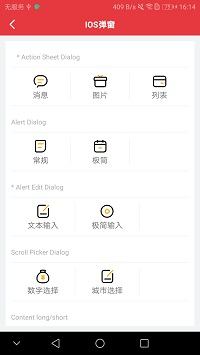
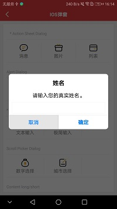
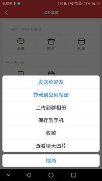
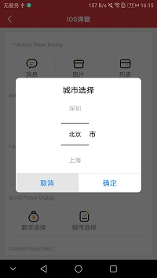
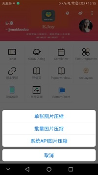
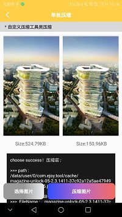
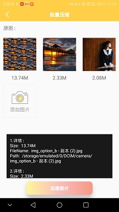
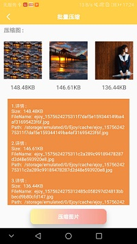
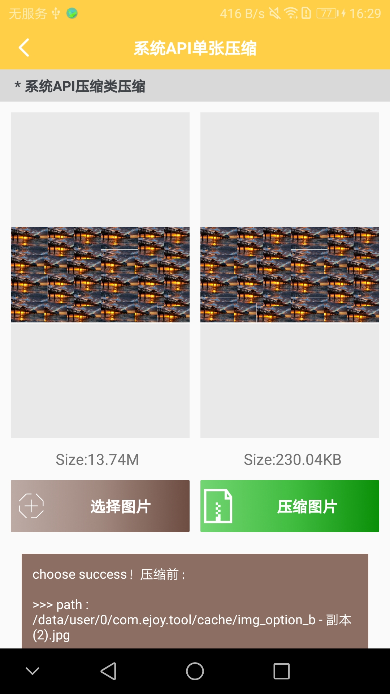
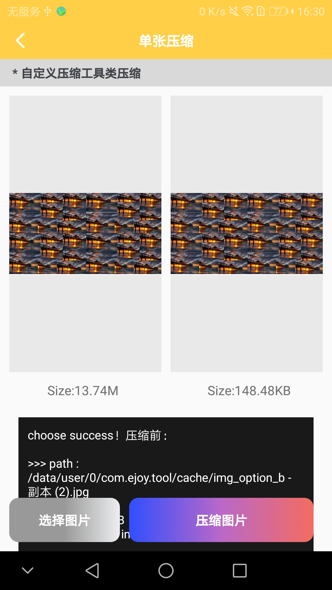

 

 

##### EJoy工具库

 

> android工具库，加入主流工具，自定义、好的解决方案等
>

##### 工具分类

 

 

> TOAST
>

* **运行效果**

 

> Dialog
>

* **运行效果**

 

> ScrollView(自定义，根据屏幕文字长度进行限定开始滑动起点)
>

* **运行效果**

 

> popupwindow(筛选菜单栏)
>

* **运行效果**

> 仿iosDialog
>

* **运行效果**

> 图片压缩：单张压缩/批量压缩/原生压缩
>

* **运行效果**

 

##### 更新日志

> 2019.12.19

**城市选择器**

* 城市列表（仿美团最新版城市选择）
* 仿IOS滚轮选择
* 三级列表选择

> 2019.12.13

* 日期时间选择器：支持日期选择、时间选择、日期时间选择。
* 省市区三级联动（待）
* 时间线（待）

> 2019.12.12

* 细节优化

> 2019.12.09

   > 仿iosDialog
   > 短篇消息
   > 列表条目
   > 长篇幅内容
   > 输入文本
   > 数字、城市选择
   > 极简布局

> 2019.12.06

* 图片压缩
   > 1.单图单压
   > 2.多图批量压缩
   > 3.系统API图片压缩

> 2019.12.04

* 相机，相册选择图片
* 图片压缩

> 2019.11.28

* WebView封装基类，避免大量使用，重复配置，造成代码冗余。
* 加入控件使用的详细HTML文档，webview加载展示

> 2019.11.27

* 沉浸式状态栏、PopupWindowFilter(筛选)、多级筛选、单级筛选等
* 修复机型沉浸式问题
* 修复fit

> 2019.11.26

* Toast优化
* IscrollView沉浸式解决方案梳理

     

> 本库会持续更新，持续维护