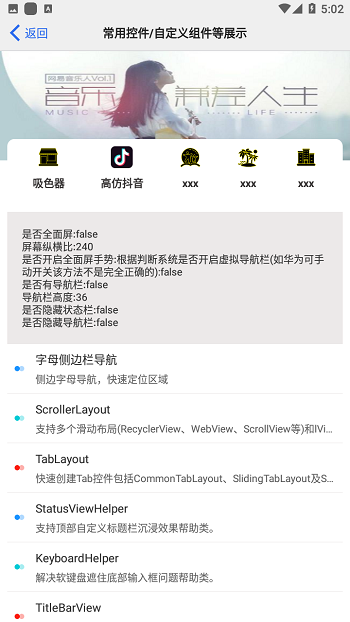

 

 

##### 💥 EShare工具库

    `山虽高，我心已决要攀登， 路再难，绊不住我的脚跟； 因为我看到生命之路就在这里。 -- 《天路历程》`

---

 

##### 项目早期没有过多的进行架构，导致项目冗余较多，目前不影响使用。有时间会逐步架构起来。

> android工具库，加入主流工具，自定义、好的解决方案等   
> 目前该库处于功能开发阶段，后期会将功能发布到Jfrog bintray,形成远程引用仓库  
> E·享 目的在于整理与集纳好的优秀方案和功能实现，有自定义功能，也有来源于网络的好的视图功能，如有侵权，请联系删除  
> 后期会加入组件化管理，便于更好演示。  
> 有好的建议或者指正的地方，请您不吝赐教，提请issue,谢谢。  
> 烦请看到的各位，共同维护创作者的知识产权，不必大肆滥用别人的成果，共建一个良好生态的技术环境，在此感谢。  

[issue](https://github.com/maiduoduo/EJoy/issues)

 

   

##### 💥 功能大纲

###### Toast  
###### Dialog   
###### Loading   
###### ScrollView   
###### FloatDragButton   
###### 版本更新   
###### 详情页   
###### 弹窗（Popupwindow、snackbar、ecookiebar、气泡消息提醒等）   
###### ArcLayout   
###### 设备工具  
###### BottomsheetDialog   
###### 日期、城市选择器（可以自由组合）   
###### 下拉刷新定制方案   
###### 通用标题栏   
###### 通用TextView   
###### ❀❀短视频板块❀❀  
###### 待做...   

   

##### 💥 更新日志

[更新日志详细-点击查看](https://github.com/maiduoduo/EJoy/blob/dev/README_DEVLOG.md)

  

##### 💥 版本日志
[更新日志详细-点击查看](https://github.com/maiduoduo/EJoy/blob/dev/README_PUBLISHLOG.md)

###### 2021.02.19
###### 2020.01.15
###### 2019.12.20

  

##### 💥 运行效果

[运行效果详情](https://github.com/maiduoduo/EJoy/blob/dev/README_RUNSHOW.md)

###### 自定义控件/组件界面

###### ❀❀短视频板块❀❀

  
  

 

> - 本库会持续更新，持续维护

   

#### 💥 ABOUT ME

**`maiduoduo`**

邮箱：	   [maiduoduo0@163.com](maiduoduo0@163.com)  
博客主页：   [https://blog.csdn.net/Maiduoudo](https://blog.csdn.net/Maiduoudo)   
Github主页：[https://github.com/maiduoduo/](https://github.com/maiduoduo/)   

  

#### 💥 THANKS

若侵联删：	[maiduoduo0@163.com](maiduoduo0@163.com)

  

#### 💥 版权信息

E·享软件遵循 MIT License 开源协议发布，并提供免费使用，请勿用于非法用途。
版权所有Copyright © 2019 by maiduoduo (maiduoduo0@163.com)
All rights reserved。

##### License

[License](https://www.apache.org/licenses/LICENSE-2.0)

>
>    Licensed under the Apache License, Version 2.0 (the "License");
>    you may not use this file except in compliance with the License.
>    You may obtain a copy of the License at
>
>       http://www.apache.org/licenses/LICENSE-2.0
>
>    Unless required by applicable law or agreed to in writing, software
>    distributed under the License is distributed on an "AS IS" BASIS,
>    WITHOUT WARRANTIES OR CONDITIONS OF ANY KIND, either express or implied.
>    See the License for the specific language governing permissions and
>    limitations under the License.
>

